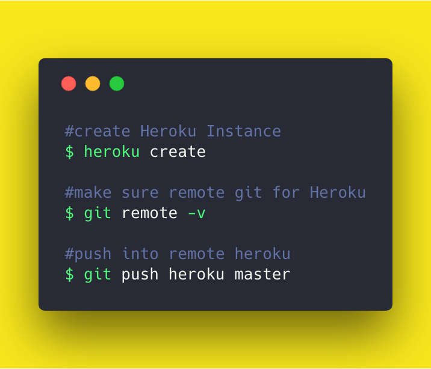

# Cheatsheet of Application Deployment on Public Cloud Services
This repository contain Basic "Hello World" deployment application on Cloud Services.


## AWS

## Azure

## Heroku
[Source](https://devcenter.heroku.com/articles/getting-started-with-nodejs)

* Initialize Heroku App Instance
```bash
heroku create
```

* Make sure Heroku Instance already added as remote git
```bash
git remote -v
```

* Make sure node application have default starting script on package.json
```json
"scripts": {
    "start": "node index.js"
  }
```

* Push into Heroku
```bash
git push heroku master
```

* tldr

